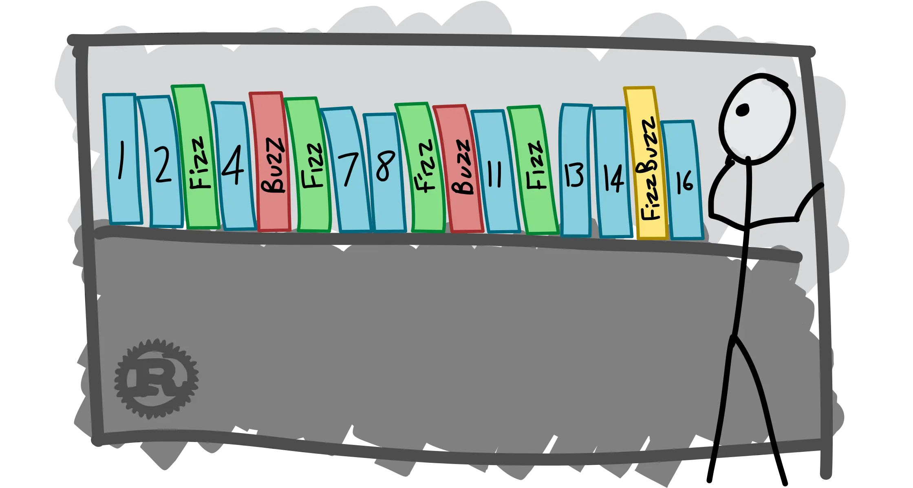

# CodaBuzz game
## Objectifs pédagogiques
- Se rappeler ensemble la syntaxe de base en C et le cycle compiler/exécuter. 
- Comprendre l’algorithme à implémenter en discutant et reformulant à deux.
- Développer à l'aide du pair programming, en alternant les rôles de conducteur (driver) et de copilote (navigator).
- Analyser les erreurs et confronter ses raisonnements grâce au dialogue permanent.
- Créer en équipe des variantes de l’algorithme ou de nouveaux tests.
- Identifier les cas de tests / échantilloner.

## Pair Programming
Avant de se lancer, découvrons ensemble ce qu'est le [Pair Programming](../PAIR-PROGRAMMING.md)

## CodaBuzz
Write a function that returns for a given number from 1 to 100 this given number, except that :
- For multiples of 3 returns “Coda”
- For the multiples of 5 returns “Buzz”
- For numbers which are multiples of both 3 and 5 returns “CodaBuzz”



Vous pouvez créer des tests comme celui-ci afin de piloter votre implémentation :
```C
void returns_number_for_classic_ones(void) {
    assert(strcmp(coda_word(1), "1") == 0);
}
```

Pour compiler et exécuter :
```shell
mkdir -p bin

# Compiler le programme principal
gcc main.c codaBuzz.c -o bin/codaBuzz
./bin/codaBuzz

# Compiler et lancer les tests
gcc test_codaBuzz.c codaBuzz.c -o bin/test_codaBuzz
./bin/test_codaBuzz
```

## Too easy ?
* Remove “if” in your code
* Parameterize your algorithm, implement this method :
    * int limit : 100
    * int coda : 3
    * int buzz : 5
* Add a voice output
* ...

### Bonus
- Montrer la puissance de l'IDE sur le refactoring
- Configurer `Actions on Save`
- `TDD`
- ...

### Conclusion
Prendre un temps de rétrospective en utilisant la matrice proposée [ici](../PAIR-PROGRAMMING.md), puis :
- What did you do faster than usual in pair ?
- What did you do slower than usual in pair ?
- How was the communication ?
- What other pros/cons did you discover during this workshop ?

> Pairing help you identify your blindspots
