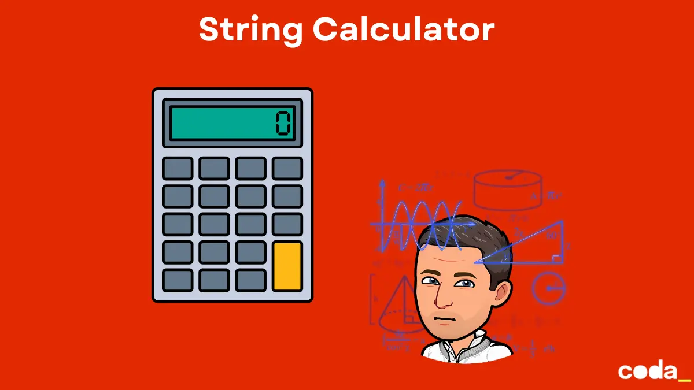

## String Calculator
### Objectifs pédagogiques
- Manipuler des chaînes de caractères et des nombres.
- Gérer des cas simples puis complexes (délimiteurs, erreurs).
- Pratiquer les boucles, les conditions et le parsing.

### Énoncé
Écrire une fonction `add` qui prend une **chaîne de caractères** représentant une liste de nombres, et retourne leur **somme**.

#### Règles de base
1. **Format de la chaîne** :
   - Par défaut, les nombres sont séparés par des **virgules** (`,`).
   - Exemple : `"1,2,3"` doit retourner `6`.

2. **Gestion des chaînes vides** :
   - Si la chaîne est vide (`""`), la fonction doit retourner `0`.

3. **Gestion d’un seul nombre** :
   - Si la chaîne ne contient qu’un seul nombre, retourner ce nombre.
   - Exemple : `"5"` doit retourner `5`.

#### Cas d'exemples

| Entrée                     | Sortie attendue | Explication                                  |
|----------------------------|-----------------|----------------------------------------------|
| `""`                       | `0`             | Chaîne vide.                                 |
| `"1"`                      | `1`             | Un seul nombre.                              |
| `"1,2,3"`                  | `6`             | Addition avec virgules.                      |
| `"1\n2,3"`                 | `6`             | Délimiteurs : virgule et saut de ligne.      |
| `"//;\n1;2;3"`             | `6`             | Délimiteur personnalisé (`;`).               |
| `"1,-2,3"`                 | Exception       | Négatifs non autorisés : `-2`.               |
| `"2,1001,3"`               | `5`             | `1001` est ignoré.                           |
| `"//[;][%]\n1;2%3"`        | `6`             | Délimiteurs multiples (`;` et `%`).          |

#### Extensions (à implémenter dans l’ordre)

1. **Délimiteurs personnalisés** :
    - Si la chaîne commence par `//[délimiteur]\n`, le délimiteur est celui spécifié entre `//` et `\n`.
    - Exemple : `"//;\n1;2;3"` doit retourner `6` (le délimiteur est `;`).

2. **Nouvelle ligne comme délimiteur** :
    - La chaîne peut contenir des **sauts de ligne** (`\n`) comme délimiteurs, en plus des virgules.
    - Exemple : `"1\n2,3"` doit retourner `6`.

3. **Gestion des erreurs** :
    - Si un nombre est **négatif**, lever une exception avec le message :
      `"Négatifs non autorisés : [liste des négatifs]"`.
    - Exemple : `"1,-2,3,-4"` doit lever une exception avec le message :
      `"Négatifs non autorisés : -2, -4"`.

4. **Ignorer les grands nombres** :
    - Les nombres **supérieurs à 1000** doivent être ignorés.
    - Exemple : `"2,1001,3"` doit retourner `5`.

5. **Délimiteurs multiples** :
    - Si la chaîne commence par `//[délim1][délim2]\n`, les délimiteurs sont `délim1` **et** `délim2`.
    - Exemple : `"//[;][%]\n1;2%3"` doit retourner `6` (délimiteurs `;` et `%`).