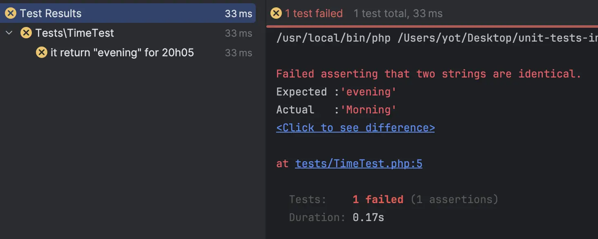
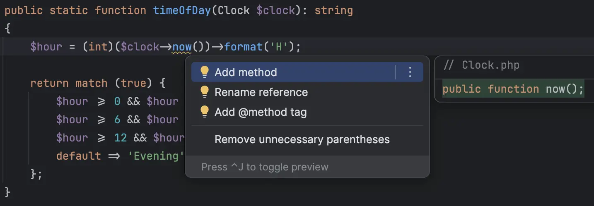

# Step-by-step - Test it or Die Trying (35')

## Calculator

- We start by a first simple test case : `9 + 3 = 12`
    - We use the `3A` pattern to describe it
    - We assert the expected result

```php
it('add : 9 + 3 = 12', function () {
    // Arrange
    $calculator = new Calculator();
    // Act
    $result = $calculator->calculate(9, 3, Operators::ADD);
    // Assert
    $this->assertSame(12, $result);
});
```

- Now that we have 1 test case we can repeat for others

```text
✅ 9 + 3 = 12
3 x 76 = 228
9 / 3 = 3
42 - 9 = 33
Unsupported operator should fail
```

- Other test cases

```php
it('add : 9 + 3 = 12', function () {
    $calculator = new Calculator();
    $result = $calculator->calculate(9, 3, Operators::ADD);
    $this->assertSame(12, $result);
});

it('multiply : 3 x 76 = 228', function () {
    $calculator = new Calculator();
    $result = $calculator->calculate(3, 76, Operators::MULTIPLY);
    $this->assertSame(228, $result);
});

it('divide : 9 / 3 = 3', function () {
    $calculator = new Calculator();
    $result = $calculator->calculate(9, 3, Operators::DIVIDE);
    $this->assertSame(3, $result);
});

it('subtract : 42 - 9 = 33', function () {
    $calculator = new Calculator();
    $result = $calculator->calculate(42, 9, Operators::SUBTRACT);
    $this->assertSame(33, $result);
});
```

- Update our test cases

```text
✅ 9 + 3 = 12
✅ 3 x 76 = 228
✅ 9 / 3 = 3
✅ 9 - 3 = 9
Unsupported operator should fail
```

- Let's implement the failure test

```php
it('fails when operator is not supported', function () {
    $calculator = new Calculator();
    $calculator->calculate(9, 3, 'Modulo');
})->throws(UnsupportedOperatorException::class, 'Unsupported operator Modulo');
```

### Refactor the tests

> You should pay the same attention to your tests as to your production code.

- Let's remove duplication
    - assertion code is duplicated
    - we instantiate 1 `Calculator` per test, but we can use the same (no state inside)
- In `pest` for this kind of test we can use the concept of `parameterized tests`
    - We need to use [`Datasets`](https://pestphp.com/docs/datasets)

- We centralize `Calculator` instantiation by using the [`beforeEach` hook](https://pestphp.com/docs/hooks) :

```php
beforeEach(function () {
    $this->calculator = new Calculator();
});
```

- We create a `Dataset`

```php
dataset('operations', [
    [9, 3, Operators::ADD, 12],
    [3, 76, Operators::MULTIPLY, 228],
    [9, 3, Operators::DIVIDE, 3],
    [9, 3, Operators::SUBTRACT, 6],
]);
```

- Then, we use it in a test :

```php
it('supports operations', function (int $a, int $b, string $operator, float|int $expected) {
    expect($this->calculator->calculate($a, $b, $operator))
        ->toBe($expected);
})->with('operations');
```

> There is one Edge case not yet supported, what happens if we divide by 0?

```text
✅ 9 + 3 = 12
✅ 3 x 76 = 228
✅ 9 / 3 = 3
✅ 9 - 3 = 9
✅ Unsupported operator should fail
Divide by 0 should fail
```

```php
beforeEach(function () {
    $this->calculator = new Calculator();
});

dataset('operations', [
    [9, 3, Operators::ADD, 12],
    [3, 76, Operators::MULTIPLY, 228],
    [9, 3, Operators::DIVIDE, 3],
    [42, 9, Operators::SUBTRACT, 33],
]);

it('supports operations', function (int $a, int $b, string $operator, float|int $expected) {
    expect($this->calculator->calculate($a, $b, $operator))
        ->toBe($expected);
})->with('operations');

it('fails when operator is not supported', function () {
    $this->calculator->calculate(9, 3, 'Modulo');
})->throws(UnsupportedOperatorException::class, 'Unsupported operator Modulo');

it('fails when dividing by zero', function () {
    $this->calculator->calculate(9, 0, Operators::DIVIDE);
})->throws(DivisionByZeroError::class);
```

## Time

- Write at least one test for it

```php
class Time
{
    public static function timeOfDay(): string
    {
        $hour = (int)(new DateTime())->format('H');

        return match (true) {
            $hour >= 0 && $hour < 6 => 'Night',
            $hour >= 6 && $hour < 12 => 'Morning',
            $hour >= 12 && $hour < 18 => 'Afternoon',
            default => 'Evening',
        };
    }
}
```

- Here is the simplest test we can write
    - Which problem will you encounter?

```php
it('return "evening" for 20h05', function () {
    $time = Time::timeOfDay();
    expect($time)->toBe('Evening');
});
```

- This test is not repeatable because the design is coupled to `new DateTime()`



- We need to isolate it to be able to test this unitary
- A few solutions here :
    - Pass a `DateTime` as method arg
    - Pass a `Clock` which will provide a `time()`method that we will be able to substitute
    - Pass a function `clock: Unit => DateTime`

To go further on properties we would like to see on tests: [TestDesiderata](https://testdesiderata.com/)

- Identify some examples

```text
6:05AM -> Morning
1:00AM -> Night
1PM -> Afternoon
8PM -> Evening
```        

### Use a Clock interface

- Adapt the `Time` to inject a `Clock` collaborator

> Generate your code from usage



```php
public static function timeOfDay(Clock $clock): string
{
    $hour = $clock->hour();

    return match (true) {
        $hour >= 0 && $hour < 6 => 'Night',
        $hour >= 6 && $hour < 12 => 'Morning',
        $hour >= 12 && $hour < 18 => 'Afternoon',
        default => 'Evening',
    };
}

interface Clock
{
    public function hour(): int;
}
```

- Now our code has no `hardcoded` dependency anymore
- We need to adapt our tests
    - How to provide a `Clock` in the given state for our test cases?
    - `Test Doubles` is our solution

- To use TestDoubles, we can use [`mockery`](https://pestphp.com/docs/mocking)

```shell
composer require mockery/mockery --dev
```

- Instantiate a `Clock` mock
    - We implement our first test case

```php
it('return "evening" for 20h05', function () {
    $clockMock = Mockery::mock(Clock::class);
    $clockMock->shouldReceive('hour')->andReturn(20);

    $time = Time::timeOfDay($clockMock);
    expect($time)->toBe('Evening');
});
```

```text
6:05AM -> Morning
1:00AM -> Night
1PM -> Afternoon
✅8PM -> Evening
```

- Implement others by using a `Parameterized Test` once again

```php
dataset('times', [
    [20, 'Evening'],
    [6, 'Morning'],
    [13, 'Afternoon'],
    [1, 'Night'],
]);

it('return string for', function (int $hour, string $expectedMessage) {
    $clockMock = Mockery::mock(Clock::class);
    $clockMock->shouldReceive('hour')->andReturn($hour);

    $time = Time::timeOfDay($clockMock);
    expect($time)->toBe($expectedMessage);
})->with('times');
```

A word on [code coverage](https://pestphp.com/docs/test-coverage)

```shell
 ./vendor/bin/pest --coverage 
```