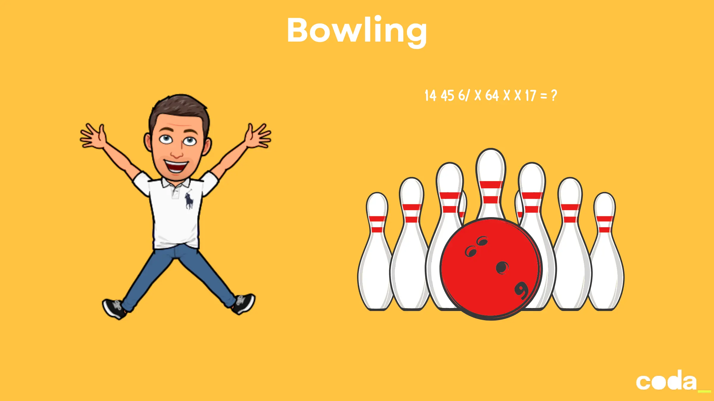

### Bowling kata

#### **Contexte**
Vous devez écrire un programme qui calcule le **score total** d’une partie de bowling en fonction des lancers effectués. Le bowling est un jeu où chaque joueur lance une boule pour faire tomber des quilles, et le score dépend de la combinaison des lancers.

### **Règles du Bowling**

#### **1. Structure d’une Partie**
- Une partie de bowling se compose de **10 tours (frames)**.
- À chaque tour, le joueur a **2 lancers** (sauf s’il réalise un *strike*).
- Le **10ème tour** peut avoir **2 ou 3 lancers** (en cas de *strike* ou *spare*).

#### **2. Calcul des Points**
- **Lancer normal** : Le nombre de quilles tombées est ajouté au score.
- **Spare (/) ** : Si un joueur fait tomber **toutes les quilles en 2 lancers** dans un tour, il marque **10 points + le nombre de quilles tombées au lancer suivant**.
- **Strike (X)** : Si un joueur fait tomber **toutes les quilles en 1 lancer**, il marque **10 points + le nombre de quilles tombées aux 2 lancers suivants**.
- **10ème tour** :
    - Si *spare* : 1 lancer supplémentaire.
    - Si *strike* : 2 lancers supplémentaires.

#### **3. Exemple de Partie**
Voici un exemple de partie et son calcul de score :

| Tour  | Lancer 1 | Lancer 2 | Lancer 3 | Score cumulé     |
|-------|----------|----------|----------|------------------|
| 1     | 1        | 4        |          | 5                |
| 2     | 4        | 5        |          | 14               |
| 3     | 6        | /        |          | 29 (10 + 5)      |
| 4     | X        |          |          | 49 (10 + 6 + 4)  |
| 5     | X        |          |          | 69 (10 + 10 + 6) |
| ...   | ...      | ...      | ...      | ...              |
| 10    | X        | 1        | 7        | 170              |

**Score total** : 170.

---

### **Objectif du Kata**
Écrire une fonction qui prend en entrée **une série de lancers** (représentés par des chiffres, `X`, ou `/`) et retourne le **score total** de la partie.

#### **Exemple d’Entrée/Sortie**
- **Entrée** : `"14 45 6/ X 64 X X 17"` (chaque paire représente un tour, sauf le 10ème).
- **Sortie** : `170`.

---

### **Contraintes**
- Gérer les **strikes** et **spares** correctement.
- Valider les **entrées** (ex. : pas plus de 10 quilles par tour, 10ème tour valide).
- Optimiser le code pour qu’il soit **lisible et maintenable**.

---

### **Objectifs Pédagogiques**
- Pratiquer la **logique de calcul** et la gestion des exceptions.
- Travailler sur la **validation des entrées**.
- Écrire des **tests unitaires** pour couvrir tous les cas (strikes, spares, 10ème tour, etc.).

---