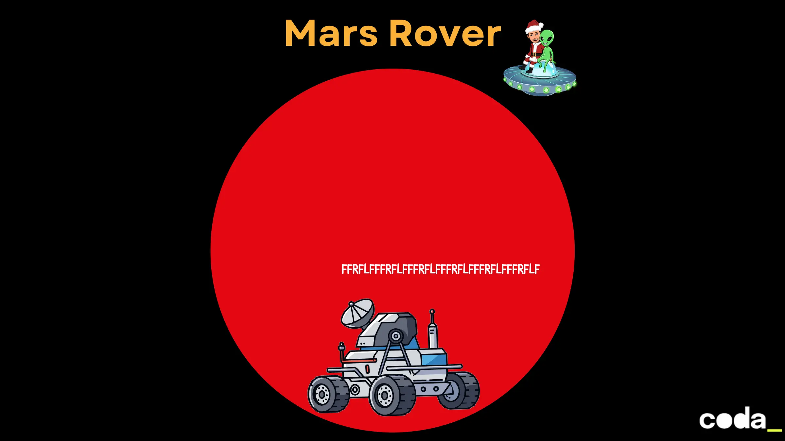

## Mars Rover Kata

#### **Contexte**
Vous développez un logiciel pour contrôler **un rover** sur Mars. 

Le rover se déplace sur un plateau rectangulaire et exécute une série de commandes pour explorer la planète.

#### **Objectifs**
Écrire un programme qui permet de :
1. **Positionner un rover** sur un plateau martien.
2. **Envoyer une série de commandes** pour le déplacer.
3. **Afficher la position finale** du rover après exécution des commandes.

---

### **Spécifications Techniques**

#### **1. Le Plateau**
- Le plateau est une grille rectangulaire de taille **N x M** (exemple : 5x5).
- Les coordonnées commencent à **(0,0)** en bas à gauche et vont jusqu’à **(N,M)** en haut à droite.

#### **2. Le Rover**
- Le rover est défini par :
    - **Sa position (x, y)** : coordonnées sur le plateau.
    - **Son orientation** : Nord (N), Sud (S), Est (E), Ouest (W).
- Exemple de position initiale : `1 2 N` (x=1, y=2, orientation Nord).

#### **3. Les Commandes**
Le rover répond aux commandes suivantes :
- **`F`** (Forward) : Avancer d’une case dans la direction actuelle.
- **`R`** (Right) : Tourner à droite (90° dans le sens horaire).
- **`L`** (Left) : Tourner à gauche (90° dans le sens anti-horaire).

Exemple de séquence de commandes : `FFRFLF`.

#### **4. Règles de Déplacement**
**"Sur Mars, modélisée comme une sphère, le plateau est considéré comme une grille toroïdale (sans bords) :
- Si le rover dépasse la limite gauche (ex. : de (0, 2) vers x=-1), il réapparaît à la limite droite (ex. : (5, 2)).
- Si le rover dépasse la limite droite (ex. : de (5, 3) vers x=6), il réapparaît à la limite gauche (ex. : (0, 3)).
- Si le rover dépasse la limite bas (ex. : de (2, 0) vers y=-1), il réapparaît en haut (ex. : (2, 5)).
- Si le rover dépasse la limite haut (ex. : de (4, 5) vers y=6), il réapparaît en bas (ex. : (4, 0))."**

---

### **Exemple d’Exécution**

#### **Entrées :**
1. **Taille du plateau** : `5 5` (5x5).
2. **Position initiale du Rover** : `1 2 N`.
3. **Commandes pour le Rover** : `FFRFLF`.

#### **Sortie Attendue :**
- **Rover** : `1 4 W` (x=1, y=4, orientation Ouest).

---

### **Contraintes**
- Le programme ne gère **qu’un seul rover**.
- Le programme doit **valider les entrées** (ex. : position initiale hors plateau, commandes invalides).

---

### **Objectifs Pédagogiques**
- Pratiquer la **programmation orientée objet** (classes `Plateau`, `Rover`).
- Gérer les **états et transitions** (position, orientation).
- Valider les **entrées/sorties** et gérer les erreurs.
- Écrire des **tests unitaires** pour vérifier le comportement.