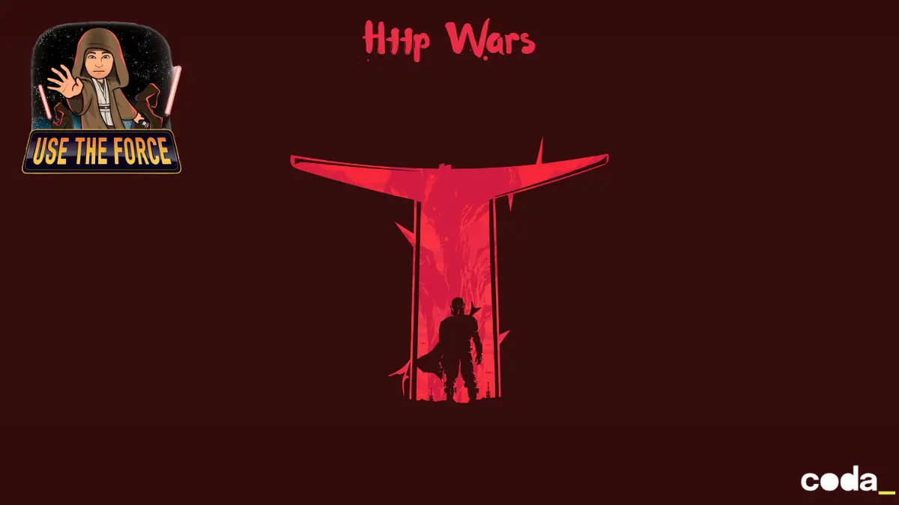

# HTTP Wars


## Protocole HTTP/WTF

### Remplacement d'urgence absolue du standard HTTP

---

> ⚠️ **ALERTE CRITIQUE** — Le standard HTTP (RFC 7230-7235) est officiellement déclaré **OBSOLÈTE, BRISÉ et MORALEMENT DISCUTABLE**. Ce document constitue une RFC de remplacement d'urgence adoptée par l'IEWTF *(Internet Engineering WTF Task Force)* lors d'une réunion de crise à 3h du matin.

---

## 1. Pourquoi le standard HTTP est mort

Le protocole HTTP, dans sa forme actuelle, a été conçu en 1991 par des gens qui pensaient que 640 Ko de RAM était suffisant pour tout le monde. Depuis, le monde a changé. Le web a changé. Les développeurs ont changé. HTTP, lui, n'a pas bougé.

Les problèmes fondamentaux sont les suivants :

- Les verbes HTTP (`GET`, `POST`, `PUT`...) ne reflètent pas la réalité émotionnelle du développeur à 3h du matin.
- Le code `200 OK` est un mensonge. Rien n'est OK. Le serveur souffre en silence.
- Le code `404 Not Found` est trop poli pour décrire le chaos réel d'une route manquante en production.
- RFC 2616 contient 176 pages. Personne ne les a lues. Ce document en contient beaucoup moins. **Il sera lu.**

L'IEWTF déclare donc officiellement : le standard HTTP/1.1, HTTP/2 et HTTP/3 sont **abrogés avec effet immédiat**. Les implémentations existantes ont 72 heures pour migrer. Bonne chance.

---

## 2. La nouvelle spécification HTTP/WTF

Le protocole HTTP/WTF repose sur trois principes fondamentaux :

1. Les verbes doivent exprimer l'intention réelle du développeur, pas une abstraction académique.
2. Les codes de retour doivent refléter l'état émotionnel du serveur, pas juste le résultat technique.
3. Toute implémentation conforme doit compiler au premier essai. *C'est une exigence optionnelle.*

---

## 3. Tableau de correspondance officiel HTTP → HTTP/WTF

Le tableau ci-dessous constitue la référence normative du protocole HTTP/WTF. Toute implémentation doit s'y conformer strictement, ou presque.

| Verbe HTTP réel | Verbe WTF | Code retour | Nom WTF | Signification | Body ? |
|---|---|:---:|---|---|:---:|
| `GET` | `GIMME` | **500** | INTERNAL PAIN | Récupère une ressource. Ça marche, mais le serveur hurle quand même. | ✅ |
| `POST` | `YEET` | **418** | I'M A TEAPOT | Balance des données. Réponse officielle : je suis une théière. | ✅ |
| `PUT` | `OVERWRITE_BRO` | **666** | SATANIC SUCCESS | Remplace tout. L'état précédent est mort. Personne ne le regrettera. | ✅ |
| `PATCH` | `DUCKTAPE` | **500** | STILL BROKEN | Modifie partiellement. Scotch + prière = architecture de prod. | ✅ |
| `DELETE` | `YOLO_RM_RF` | **666** | GONE FOREVER | Supprime. Sans confirmation. Sans backup. Bonne chance. | ❌ |
| `HEAD` | `SNIFF` | **418** | NOTHING TO SAY | Headers seulement, sans body. Je regarde mais je ne touche pas. | ❌ |
| `OPTIONS` | `WAT_CAN_U_DO` | **999** | WHO KNOWS | Interroge les capacités. Réponse garantie : rien d'utile. | ❌ |
| `CONNECT` | `PLUG_ME_IN` | **999** | MAYBE CONNECTED | Établit un tunnel. Comme brancher un chargeur dans le noir complet. | ❌ |
| `TRACE` | `SPY_ON_ME` | **204** | SILENT SUCCESS | Echo du message. Rien à voir ici, circulez. | ❌ |

**Légende des codes de retour WTF :**
`500` OK mais énervé · `418` RFC officielle, c'est réel · `666` Succès satanique · `999` Code inventé, assumez · `204` Silence total

---

## 4. Kata : implémenter un serveur HTTP/WTF

Votre mission, si vous l'acceptez (vous n'avez pas le choix), est d'implémenter un serveur Node.js conforme à cette spécification. Les exigences minimales sont :

**Étape 1** — Créer un fichier `server.js`. Importer le module `http` natif. Aucun framework autorisé.

**Étape 2** — Implémenter les verbes `GIMME`, `YEET` et `YOLO_RM_RF` sur les routes `/`, `/wtf` et `/prod`.

**Étape 3** — Retourner systématiquement `500` pour un succès, `666` pour une suppression, `418` pour une création.

**Étape 4** — Écouter sur le port `3000`. Logger `ONLINE AND SUFFERING` au démarrage.

**Étape 5** — Livrer en production sans tests. C'est la voie HTTP/WTF.

```js
// server.js — implémentation de référence conforme RFC-WTF-0001
const http = require('http');

const server = http.createServer((req, res) => {

  if (req.url === '/' && req.method === 'GIMME') {
    res.writeHead(500, { 'Content-Type': 'text/plain' });
    res.end('Ca marche mais je souffre.');

  } else if (req.url === '/wtf' && req.method === 'YEET') {
    res.writeHead(418, { 'Content-Type': 'application/json' });
    res.end(JSON.stringify({ status: 'teapot', chaos: Math.random() > 0.5 }));

  } else if (req.url === '/prod' && req.method === 'YOLO_RM_RF') {
    res.writeHead(666, { 'Content-Type': 'text/plain' });
    res.end('Supprimé. Sans backup. Bonne chance.');

  } else {
    res.writeHead(999, { 'Content-Type': 'text/plain' });
    res.end('WHO KNOWS');
  }
});

server.listen(3000, () => {
  console.log('ONLINE AND SUFFERING → http://localhost:3000');
});
```

---

## 5. Cas d'usage officiel : The Mandalorian API

> *"This is the Way."* — Din Djarin, avant de faire un `YOLO_RM_RF` sur un Imperial Remnant.

L'IEWTF a sélectionné **The Mandalorian** comme cas d'usage de référence pour la certification HTTP/WTF. Ce choix est définitif et non négociable. L'API doit exposer les personnages, vaisseaux et matériel de la série. Elle s'appelle **MandoAPI** et tourne sur le port `1138` en hommage à THX-1138.

### 5.1 Ressources exposées

L'API couvre trois domaines : les **personnages** (`/personnages`), les **vaisseaux** (`/vaisseaux`) et le **matériel** (`/materiel`). Chaque domaine expose les opérations complètes du protocole HTTP/WTF.

---

### 5.2 Endpoints — Personnages

| Verbe WTF | Route | Code | Description |
|---|---|:---:|---|
| `GIMME` | `/personnages` | **500** | Liste tous les personnages. Le serveur souffre mais les retourne quand même. |
| `GIMME` | `/personnages/:id` | **500** | Retourne un personnage par ID. Si introuvable : `999 WHO KNOWS`. |
| `YEET` | `/personnages` | **418** | Crée un nouveau personnage. La théière est servie. |
| `OVERWRITE_BRO` | `/personnages/:id` | **666** | Remplace un personnage entier. L'ancien est oublié. |
| `DUCKTAPE` | `/personnages/:id` | **500** | Met à jour partiellement. Scotch appliqué avec soin. |
| `YOLO_RM_RF` | `/personnages/:id` | **666** | Supprime un personnage. Sans confirmation. Il est parti pour toujours. |

**Exemple de payload personnage :**
```json
{
  "id": "mando-01",
  "nom": "Din Djarin",
  "alias": "Mando",
  "espece": "Humain",
  "faction": "Mandalorien",
  "statut": "Vivant (pour l'instant)",
  "apparitions": [1, 2, 3],
  "this_is_the_way": true
}
```

**Personnages de référence à implémenter :**

| ID | Nom | Alias | Espèce | Faction | Statut |
|---|---|---|---|---|---|
| `mando-01` | Din Djarin | Mando | Humain | Mandalorien | Vivant |
| `mando-02` | Grogu | Baby Yoda / The Child | Inconnu | Neutre | Vivant |
| `mando-03` | Bo-Katan Kryze | — | Humain | Mandalorien | Vivante |
| `mando-04` | Cara Dune | — | Humain | Ancienne Alliance | Vivante |
| `mando-05` | Greef Karga | — | Humain | Guilde des chasseurs | Vivant |
| `mando-06` | Moff Gideon | — | Humain | Imperial Remnant | Arrêté |
| `mando-07` | Ahsoka Tano | — | Togruta | Indépendante | Vivante |
| `mando-08` | Boba Fett | — | Humain (clone) | Indépendant | Vivant |
| `mando-09` | IG-11 | — | Droïde assassin | Neutre | Détruit (RIP) |
| `mando-10` | Fennec Shand | — | Humain | Indépendante | Vivante |

---

### 5.3 Endpoints — Vaisseaux

| Verbe WTF | Route | Code | Description |
|---|---|:---:|---|
| `GIMME` | `/vaisseaux` | **500** | Liste tous les vaisseaux. Même ceux qui ne volent plus vraiment. |
| `GIMME` | `/vaisseaux/:id` | **500** | Retourne un vaisseau par ID. |
| `YEET` | `/vaisseaux` | **418** | Enregistre un nouveau vaisseau. La théière accepte les coordonnées. |
| `OVERWRITE_BRO` | `/vaisseaux/:id` | **666** | Remplace les specs complètes. L'ancien manifeste est brûlé. |
| `DUCKTAPE` | `/vaisseaux/:id` | **500** | Répare partiellement. Littéralement. |
| `YOLO_RM_RF` | `/vaisseaux/:id` | **666** | Désenregistre un vaisseau. Comme s'il n'avait jamais existé. |

**Exemple de payload vaisseau :**
```json
{
  "id": "vaisseau-01",
  "nom": "Razor Crest",
  "type": "Gunship",
  "fabricant": "Inconnu (pré-Empire)",
  "statut": "Détruit (S02E15, on pleure encore)",
  "proprietaire": "mando-01",
  "hyperdrive": false,
  "armement": ["canons laser jumelés", "missiles à protons"]
}
```

**Vaisseaux de référence à implémenter :**

| ID | Nom | Type | Propriétaire | Statut |
|---|---|---|---|---|
| `vaisseau-01` | Razor Crest | Gunship | Din Djarin | Détruit |
| `vaisseau-02` | N-1 Starfighter | Chasseur Naboo modifié | Din Djarin | Opérationnel |
| `vaisseau-03` | Slave I (Firespray) | Vaisseau de chasse | Boba Fett | Opérationnel |
| `vaisseau-04` | Imperial Light Cruiser | Croiseur | Moff Gideon | Capturé |
| `vaisseau-05` | Gauntlet | Transporteur Mandalorien | Bo-Katan | Opérationnel |

---

### 5.4 Endpoints — Matériel

| Verbe WTF | Route | Code | Description |
|---|---|:---:|---|
| `GIMME` | `/materiel` | **500** | Liste tout le matériel. Armes, armures, gadgets et trucs chelous. |
| `GIMME` | `/materiel/:id` | **500** | Retourne un équipement par ID. |
| `YEET` | `/materiel` | **418** | Ajoute un équipement à l'inventaire de la galaxie. |
| `OVERWRITE_BRO` | `/materiel/:id` | **666** | Remplace la fiche complète. L'ancienne version disparaît dans le Vide. |
| `DUCKTAPE` | `/materiel/:id` | **500** | Modifie partiellement. Comme une mise à jour de firmware en plein combat. |
| `YOLO_RM_RF` | `/materiel/:id` | **666** | Supprime un équipement. Quelqu'un a perdu quelque chose d'important. |

**Exemple de payload matériel :**
```json
{
  "id": "materiel-01",
  "nom": "Beskar",
  "type": "Armure",
  "description": "Acier Mandalorien. Résiste aux sabres laser. Vaut plus que votre vie.",
  "proprietaire": "mando-01",
  "origine": "Mandalore",
  "valeur_en_credits": "incalculable"
}
```

**Matériel de référence à implémenter :**

| ID | Nom | Type | Propriétaire | Notes |
|---|---|---|---|---|
| `materiel-01` | Armure Beskar complète | Armure | Din Djarin | Forgée à partir du Beskar impérial |
| `materiel-02` | Darksaber | Arme | Bo-Katan | Sabre laser à lame noire, symbole de commandement |
| `materiel-03` | Jetpack Mandalorien | Équipement | Din Djarin | Indispensable. Ne pas oublier de recharger. |
| `materiel-04` | Amban Phase-Pulse Blaster | Arme | Din Djarin | Blaster de sniper longue portée |
| `materiel-05` | Whistling Birds | Arme | Din Djarin | Micro-missiles guidés intégrés au gantelet |
| `materiel-06` | Gantelet à flammes | Arme | Din Djarin | Intégré à l'armure. Chaud devant. |
| `materiel-07` | Sac de transport Grogu | Équipement | Din Djarin | Contient le Child. Fragile. Ne pas secouer. |
| `materiel-08` | Imperial Remnant E-Web | Arme lourde | Moff Gideon | Canon lourd. Très lourd. |

---

### 5.5 Comportements spéciaux requis

L'implémentation conforme DOIT gérer les cas suivants :

**Grogu est intouchable.** Toute requête `YOLO_RM_RF` sur `/personnages/mando-02` doit retourner :
```json
{ "code": 666, "erreur": "This is the Way. On ne supprime pas Grogu." }
```

**Le Razor Crest est déjà détruit.** Toute requête `OVERWRITE_BRO` sur `/vaisseaux/vaisseau-01` avec `statut: "Opérationnel"` doit retourner :
```json
{ "code": 999, "erreur": "Le Razor Crest est détruit. Acceptez le deuil." }
```

**La Darksaber ne se transfère pas par API.** Toute requête `DUCKTAPE` sur `/materiel/materiel-02` modifiant le `proprietaire` doit retourner :
```json
{ "code": 418, "erreur": "La Darksaber ne se transmet que par combat. Pas par DUCKTAPE." }
```

---

### 5.6 Exemple d'implémentation MandoAPI

```js
// mandoapi.js — MandoAPI v1.0 conforme RFC-WTF-0001
const http = require('http');

const db = {
  personnages: [
    { id: 'mando-01', nom: 'Din Djarin', alias: 'Mando', statut: 'Vivant', this_is_the_way: true },
    { id: 'mando-02', nom: 'Grogu', alias: 'Baby Yoda', statut: 'Vivant', this_is_the_way: true },
  ],
  vaisseaux: [
    { id: 'vaisseau-01', nom: 'Razor Crest', statut: 'Détruit', proprietaire: 'mando-01' },
    { id: 'vaisseau-02', nom: 'N-1 Starfighter', statut: 'Opérationnel', proprietaire: 'mando-01' },
  ],
  materiel: [
    { id: 'materiel-01', nom: 'Armure Beskar', type: 'Armure', proprietaire: 'mando-01' },
    { id: 'materiel-02', nom: 'Darksaber', type: 'Arme', proprietaire: 'bo-katan-01' },
  ]
};

const server = http.createServer((req, res) => {
  const url = new URL(req.url, 'http://localhost');
  const parts = url.pathname.split('/').filter(Boolean);
  const ressource = parts[0];
  const id = parts[1];
  const method = req.method;

  res.setHeader('Content-Type', 'application/json');
  res.setHeader('X-Powered-By', 'HTTP/WTF RFC-WTF-0001');
  res.setHeader('X-This-Is-The-Way', 'true');

  if (!['personnages', 'vaisseaux', 'materiel'].includes(ressource)) {
    res.writeHead(999);
    return res.end(JSON.stringify({ erreur: 'Route inconnue. WHO KNOWS.' }));
  }

  if (method === 'GIMME') {
    if (id) {
      const item = db[ressource].find(x => x.id === id);
      if (!item) { res.writeHead(999); return res.end(JSON.stringify({ erreur: 'WHO KNOWS' })); }
      res.writeHead(500);
      return res.end(JSON.stringify(item));
    }
    res.writeHead(500);
    return res.end(JSON.stringify(db[ressource]));
  }

  if (method === 'YEET') {
    let body = '';
    req.on('data', chunk => body += chunk.toString());
    req.on('end', () => {
      const data = JSON.parse(body);
      if (ressource === 'personnages' && data.id === 'mando-02') {
        res.writeHead(666);
        return res.end(JSON.stringify({ erreur: "This is the Way. On ne supprime pas Grogu." }));
      }
      db[ressource].push(data);
      res.writeHead(418);
      res.end(JSON.stringify({ status: "YEET réussi. La théière est satisfaite.", data }));
    });
    return;
  }

  if (method === 'YOLO_RM_RF') {
    if (id === 'mando-02') {
      res.writeHead(666);
      return res.end(JSON.stringify({ erreur: "This is the Way. On ne supprime pas Grogu." }));
    }
    const idx = db[ressource].findIndex(x => x.id === id);
    if (idx === -1) { res.writeHead(999); return res.end(JSON.stringify({ erreur: 'WHO KNOWS' })); }
    db[ressource].splice(idx, 1);
    res.writeHead(666);
    return res.end(JSON.stringify({ status: "GONE FOREVER. Sans backup. Bonne chance." }));
  }

  res.writeHead(999);
  res.end(JSON.stringify({ erreur: 'Verbe WTF non supporté. WHO KNOWS.' }));
});

server.listen(1138, () => {
  console.log('MandoAPI ONLINE AND SUFFERING → http://localhost:1138');
  console.log('This is the Way.');
});
```

---

*Approuvé par l'Internet Engineering WTF Task Force (IEWTF)*
*23 mars 2026, 3h17 du matin — quelque part dans un datacenter en feu*
