# Pair Programming
## Avantages / Inconvénients - 10'
- En binômes, chasser sur internet c'est quoi le Pair Programming - 5'
    - Quels sont les rôles associés ?
    - Quels sont les avantages et inconvénients du `Pair Programming`
- Partage collectif - 5'

## C'est quoi "réellement" le `Pair Programming` - 15'
[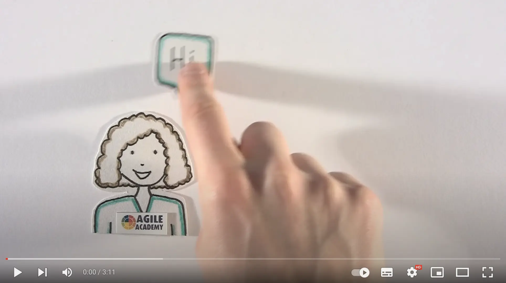](https://youtu.be/ET3Q6zNK3Io)

- Qu'est-ce que vous avez vu ?
- Qu'est-ce que vous en pensez ?
- Quels sont les 2 rôles ?

  

  Pros and cons
  

| Pros                                           | Cons                 |
|------------------------------------------------|----------------------|
| Instantly shared best practices / knowledge    | Tiring               |
| Improved design / code quality                 | Can create frictions |
| Fewer mistakes                                 |                      |
| Faster on-boarding                             |                      |
| Increase moral / confidence                    |                      |
| Increase team cohesion / collective ownership  |                      |
| Instant code reviews (shortest feedback loops) |                      |

### Ce que ce n'est pas
Not 1 person sleeping and another one working

### When pairing helps
- Better efficiency
- Improve technical skills
- Aid transfer knowledge
- Improve communication
- Enhance problem-solving capabilities
- Simplify the existing code base

## Different styles
The Different Styles of Pair Programming (more details [here](https://www.drovio.com/blog/the-different-styles-of-pair-programming/))

#### Driver-Navigator
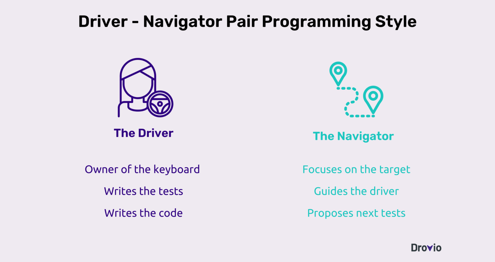

> When do we change the roles?

#### Strong Style
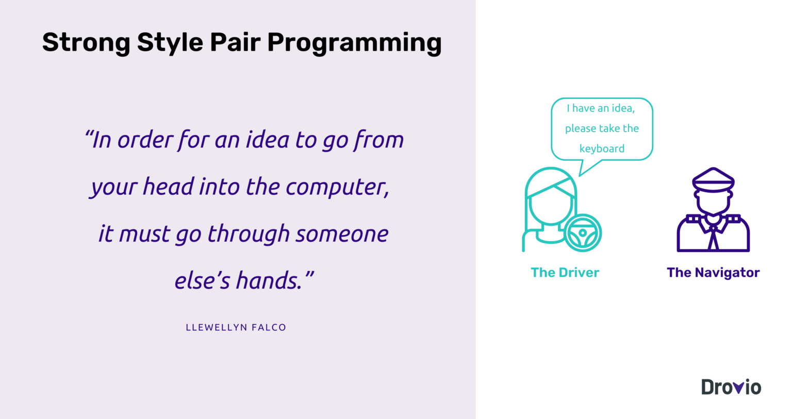

#### Ping-Pong
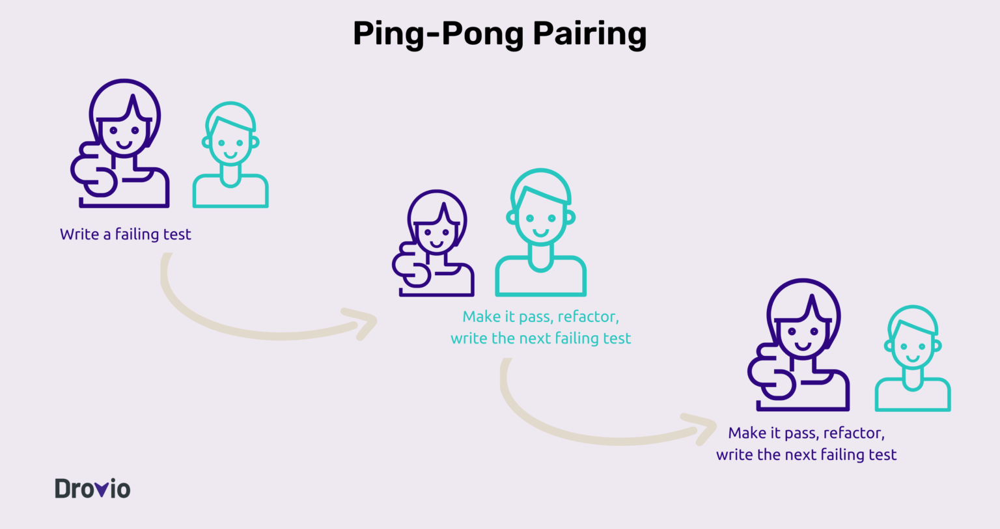

#### Unstructured
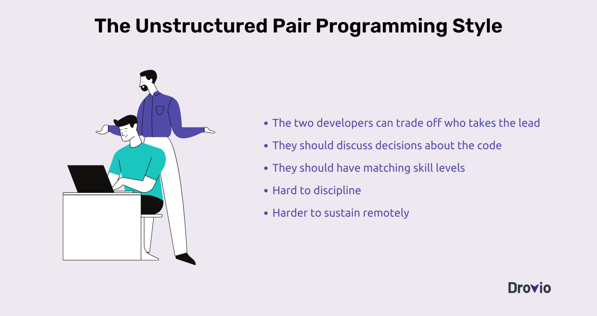

#### Backseat Navigator
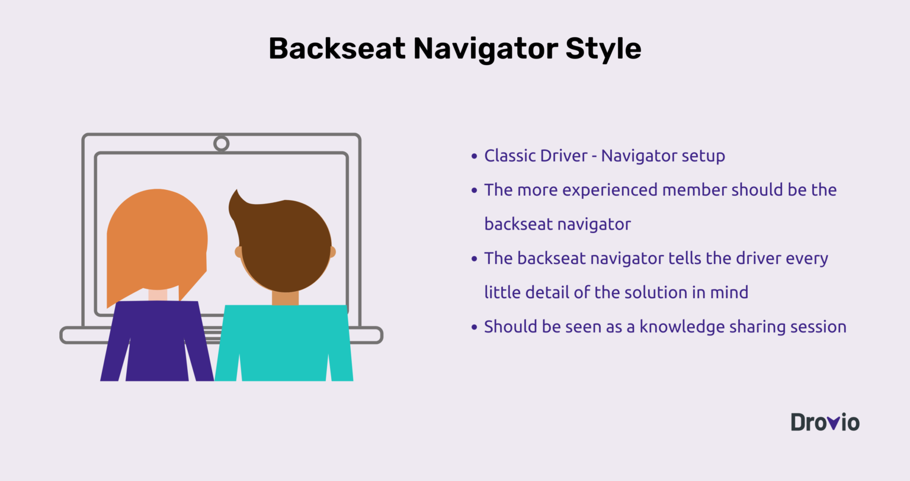

#### Tour Guide
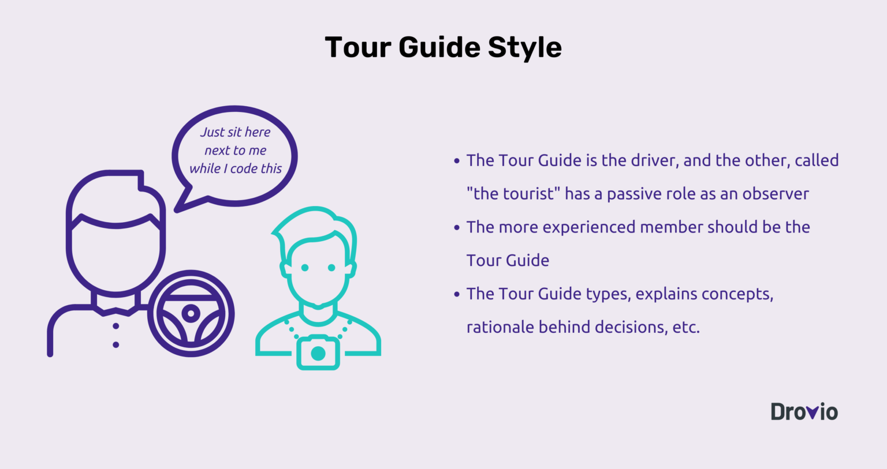

> To start pairing, use a timer.

## What about its cost?
[The Costs and Benefits of Pair Programming Alistair Cockburn & Laurie Williams](https://www.researchgate.net/publication/2333697_The_Costs_and_Benefits_of_Pair_Programming)
- The development cost is approximately `15% higher`

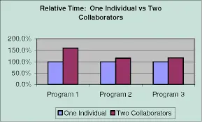

> BUT repaid in :

- Shorter and less expensive testing
- Higher quality assurance

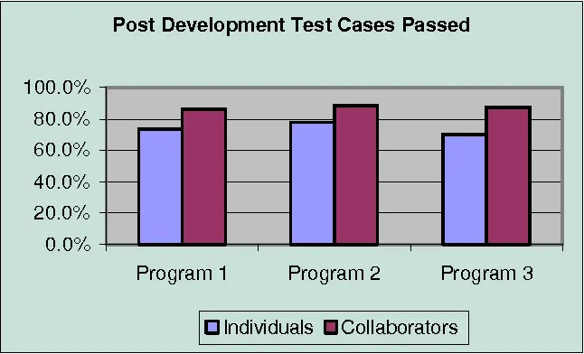

- Less complex code / better code quality
- Less field support

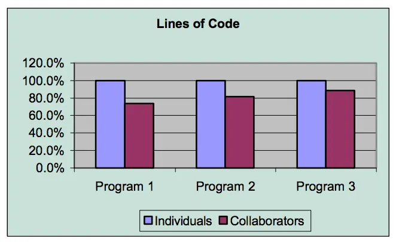

## Best Practices
- Take notes
    - Decision points
    - Pros / cons
- Build confidence:
    - `Commit` often
    - Write quality unit tests
- Communicate – without violence
    - To propose an idea : “I think...”
    - To confirm agreement : “Do we agree...”
    - To discuss progress towards goals : “We agree...”
    - Avoid saying “No” / ”But”
        - Instead try saying, “Yes and...”
    - Ask “What would it take to get you in...” if you disagree about a proposed idea
- Reflect
    - At the end of the session
    - Small retro : what did we learn, what can be improved, ...

## Prendre du recul sur la pratique #continuous-improvement
De manière générale, lorsque vous travaillez en binôme, prenez le temps de réfléchir à votre pratique en fin de session :
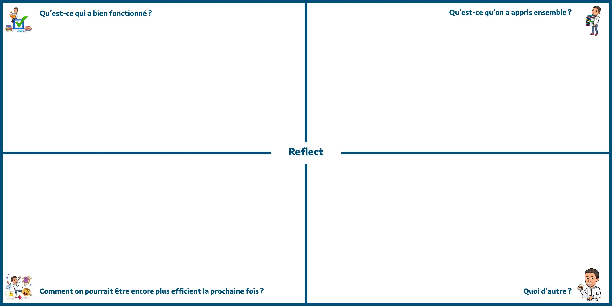