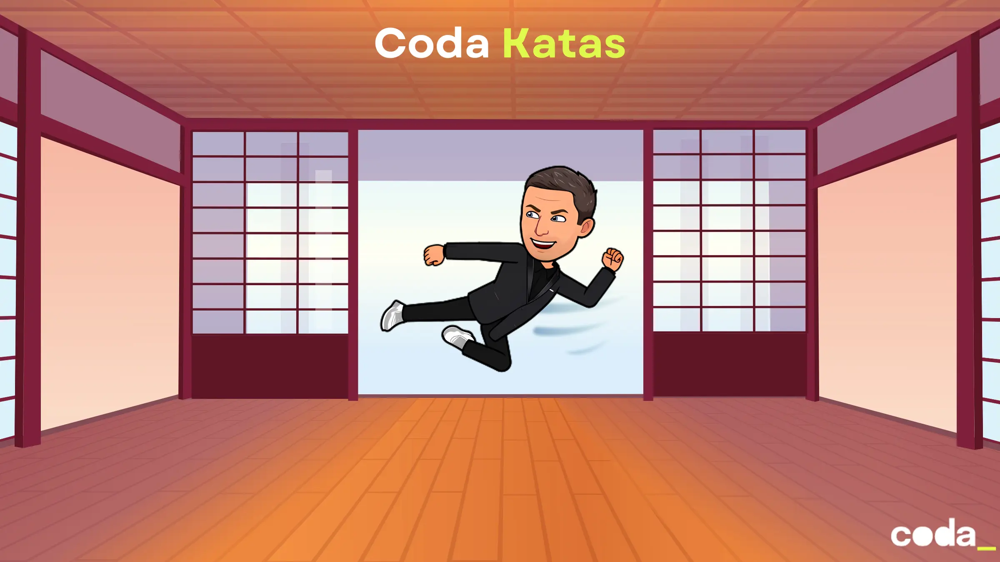

# Coda Katas
Sur ce repository, nous centralisons des code katas à destination de nos étudiants avec une courbe d'apprentissage et des objectifs pédagogiques identifiés dans chaque `README`.

- [CodaBuzz](01.coda-buzz/README.md)
- [Prime numbers](02.prime/README.md)
- [Pricing](03.pricing/README.md)
- [Ecrire ses premiers tests](04.unit-tests/README.md)
- [String Calculator](05.stringCalculator/README.md)
- [Manhattan Distance](06.manhattan-distance/README.md)
- [Bowling Game](07.bowling-kata/README.md)
- [Mars Rover](08.mars-rover/README.md)
- [Algorithmique Wars](09.algos-star-wars/README.md)